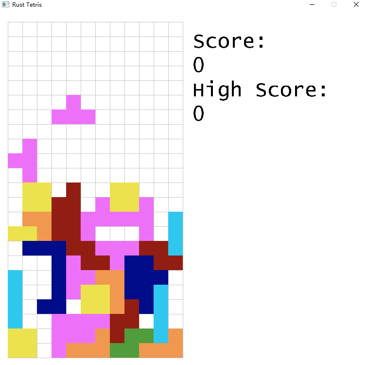

## 用 Rust + SDL2 实现俄罗斯方块游戏
## Build
### Windows
``` bash
# use build.rs to download sdl2 lib
cargo build
```
### MAC:
```
brew install sdl2 sdl2_mixer sdl2_image sdl2_ttf
LIBRARY_PATH="$LIBRARY_PATH:$(brew --prefix)/lib" cargo build
```

